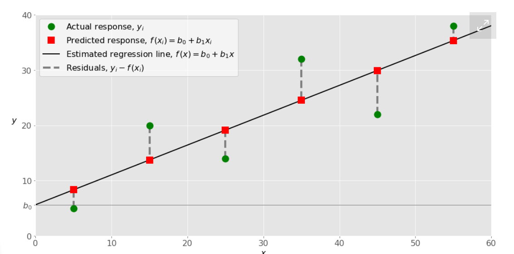

# How to Run Linear Regression in Python
linear regression is a popular technique and you might as well seen the mathematical equation of linear regression.
 There are several ways to implement linear regression in Python. you can do linear regression using numpy, scipy, stats model and sckit learn. But this post will explain how to use scikit learn to perform linear regression.

 Scikit-learn : is a powerful Python module for machine learning. It contains function for regression, classification, clustering, model selection and dimensionality reduction. Today, I will explore the sklearn.linear_model module which contains “methods intended for regression in which the target value is expected to be a linear combination of the input variables”.

# Linear Regression in Python

Linear regression is one of the fundamental statistical and machine learning techniques. Whether you want to do statistics, machine learning, or scientific computing, there are good chances that you’ll need it. It’s advisable to learn it first and then proceed towards more complex methods.

 What Is Regression?
Regression searches for relationships among variables.

For example, you can observe several employees of some company and try to understand how their salaries depend on the features, such as experience, level of education, role, city they work in, and so on.

This is a regression problem where data related to each employee represent one observation. The presumption is that the experience, education, role, and city are the independent features, while the salary depends on them.

Similarly, you can try to establish a mathematical dependence of the prices of houses on their areas, numbers of bedrooms, distances to the city center, and so on.

Generally, in regression analysis, you usually consider some phenomenon of interest and have a number of observations. Each observation has two or more features. Following the assumption that (at least) one of the features depends on the others, you try to establish a relation among them.

In other words, you need to find a function that maps some features or variables to others sufficiently well.

The dependent features are called the dependent variables, outputs, or responses.

The independent features are called the independent variables, inputs, or predictors.

Regression problems usually have one continuous and unbounded dependent variable. The inputs, however, can be continuous, discrete, or even categorical data such as gender, nationality, brand, and so on.

It is a common practice to denote the outputs with 𝑦 and inputs with 𝑥. If there are two or more independent variables, they can be represented as the vector 𝐱 = (𝑥₁, …, 𝑥ᵣ), where 𝑟 is the number of inputs.

- Simple Linear Regression
Simple or single-variate linear regression is the simplest case of linear regression with a single independent variable, 𝐱 = 𝑥.

The following figure illustrates simple linear regression:

When Do You Need Regression?
Typically, you need regression to answer whether and how some phenomenon influences the other or how several variables are related. For example, you can use it to determine if and to what extent the experience or gender impact salaries.

Regression is also useful when you want to forecast a response using a new set of predictors. For example, you could try to predict electricity consumption of a household for the next hour given the outdoor temperature, time of day, and number of residents in that household.

Regression is used in many different fields: economy, computer science, social sciences, and so on. Its importance rises every day with the availability of large amounts of data and increased awareness of the practical value of data.

Linear Regression
Linear regression is probably one of the most important and widely used regression techniques. It’s among the simplest regression methods. One of its main advantages is the ease of interpreting results.

Problem Formulation
When implementing linear regression of some dependent variable 𝑦 on the set of independent variables 𝐱 = (𝑥₁, …, 𝑥ᵣ), where 𝑟 is the number of predictors, you assume a linear relationship between 𝑦 and 𝐱: 𝑦 = 𝛽₀ + 𝛽₁𝑥₁ + ⋯ + 𝛽ᵣ𝑥ᵣ + 𝜀. This equation is the regression equation. 𝛽₀, 𝛽₁, …, 𝛽ᵣ are the regression coefficients, and 𝜀 is the random error.

Linear regression calculates the estimators of the regression coefficients or simply the predicted weights, denoted with 𝑏₀, 𝑏₁, …, 𝑏ᵣ. They define the estimated regression function 𝑓(𝐱) = 𝑏₀ + 𝑏₁𝑥₁ + ⋯ + 𝑏ᵣ𝑥ᵣ. This function should capture the dependencies between the inputs and output sufficiently well.

The estimated or predicted response, 𝑓(𝐱ᵢ), for each observation 𝑖 = 1, …, 𝑛, should be as close as possible to the corresponding actual response 𝑦ᵢ. The differences 𝑦ᵢ - 𝑓(𝐱ᵢ) for all observations 𝑖 = 1, …, 𝑛, are called the residuals. Regression is about determining the best predicted weights, that is the weights corresponding to the smallest residuals.

To get the best weights, you usually minimize the sum of squared residuals (SSR) for all observations 𝑖 = 1, …, 𝑛: SSR = Σᵢ(𝑦ᵢ - 𝑓(𝐱ᵢ))². This approach is called the method of ordinary least squares.

 
Regression Performance : 
The variation of actual responses 𝑦ᵢ, 𝑖 = 1, …, 𝑛, occurs partly due to the dependence on the predictors 𝐱ᵢ. However, there is also an additional inherent variance of the output.

The coefficient of determination, denoted as 𝑅², tells you which amount of variation in 𝑦 can be explained by the dependence on 𝐱 using the particular regression model. Larger 𝑅² indicates a better fit and means that the model can better explain the variation of the output with different inputs.

The value 𝑅² = 1 corresponds to SSR = 0, that is to the perfect fit since the values of predicted and actual responses fit completely to each other.

Simple Linear Regression :
Simple or single-variate linear regression is the simplest case of linear regression with a single independent variable, 𝐱 = 𝑥.

The following figure illustrates simple linear regression:

 
What linear regression is?

What linear regression is used for
How linear regression works
How to implement linear regression in Python, step by step
Free Bonus: Click here to get access to a free NumPy Resources Guide that points you to the best tutorials, videos, and books for improving your NumPy skills.

Regression: 
Regression analysis is one of the most important fields in statistics and machine learning. There are many regression methods available. Linear regression is one of them.

Python Packages for Linear Regression:

The package NumPy is a fundamental Python scientific package that allows many high-performance operations on single- and multi-dimensional arrays. It also offers many mathematical routines. Of course, it’s open source.
The package scikit-learn is a widely used Python library for machine learning, built on top of NumPy and some other packages. It provides the means for preprocessing data, reducing dimensionality, implementing regression, classification, clustering, and more. Like NumPy, scikit-learn is also open source.

- Linear regression is implemented with the following:

scikit-learn if you don’t need detailed results and want to use the approach consistent with other regression techniques
statsmodels if you need the advanced statistical parameters of a model
Both approaches are worth learning how to use and exploring further. The links in this article can be very useful for that.

- Simple Linear Regression With scikit-learn
Let’s start with the simplest case, which is simple linear regression.

There are five basic steps when you’re implementing linear regression:

1- Import the packages and classes you need.
2- Provide data to work with and eventually do appropriate transformations.
3- Create a regression model and fit it with existing data.
4- Check the results of model fitting to know whether the model is satisfactory.
5- Apply the model for predictions.

# Introduction to Simple Linear Regressions

linear regression regression analysis explores the relationship between a quantitative response variable and one or more explanatory variables if there's only one explanatory variable it's called simple linear regression and if there's more than one explanatory variable we call that multiple regression  .

 