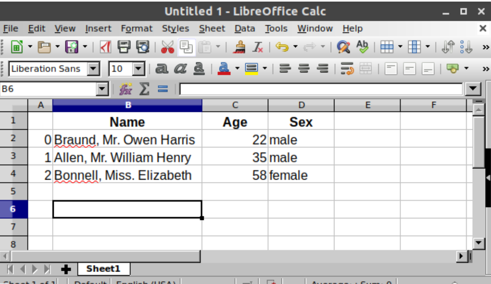

## Pandas in 10

pandas will help you to explore, clean, and process your data. In pandas, a data table is called a DataFrame.
 
the fundamental difference between pandas and NumPy: NumPy arrays have one dtype for the entire array, while pandas DataFrames have one dtype per column. When you call DataFrame.to_numpy(), pandas will find the NumPy dtype that can hold all of the dtypes in the DataFrame. This may end up being object, which requires casting every value to a Python object.

- describe() shows a quick statistic summary of your data.

- Using the isin() method for filtering the data.


 
---
 ## Pandas - Getting Started
 To load the pandas package and start working with it, import the package. The community agreed alias for pandas is pd, so loading pandas as pd is assumed standard practice for all of the pandas documentation.
 ```
 import pandas as pd
 ```
 To manually store data in a table, create a DataFrame. When using a Python dictionary of lists, the dictionary keys will be used as column headers and the values in each list as columns of the DataFrame.

A DataFrame : is a 2-dimensional data structure that can store data of different types (including characters, integers, floating point values, categorical data and more) in columns. It is similar to a spreadsheet, a SQL table or the data.frame in R.

The table has 3 columns, each of them with a column label. The column labels are respectively Name, Age and Sex.

The column Name consists of textual data with each value a string, the column Age are numbers and the column Sex is textual data.


 
 Each column in a DataFrame is a Series

 When selecting a single column of a pandas DataFrame, the result is a pandas Series. To select the column, use the column label in between square brackets [].

Note

 the selection of a single column is very similar to selection of dictionary values based on the key.

 Similar to spreadsheet software, pandas represents data as a table with columns and rows. Apart from the representation, also the data manipulations and calculations you would do in spreadsheet software are supported by pandas. Continue reading the next tutorials to get started!

 - Import the package, aka import pandas as pd

- A table of data is stored as a pandas DataFrame

- Each column in a DataFrame is a Series

- You can do things by applying a method to a DataFrame or Series

### How do I read and write tabular data?

pandas provides the read_csv() function to read data stored as a csv file into a pandas DataFrame. pandas supports many different file formats or data sources out of the box (csv, excel, sql, json, parquet, …), each of them with the prefix read_*.

Make sure to always have a check on the data after reading in the data


### How do I select specific columns from a DataFrame?

- When selecting subsets of data, square brackets [] are used.

- Inside these brackets, you can use a single column/row label, a list of column/row labels, a slice of labels, a conditional expression or a colon.

- Select specific rows and/or columns using loc when using the row and column names

- Select specific rows and/or columns using iloc when using the positions in the table

- You can assign new values to a selection based on loc/iloc

### How to create plots in pandas?

- The .plot.* methods are applicable on both Series and DataFrames

- By default, each of the columns is plotted as a different element (line, boxplot,…)

- Any plot created by pandas is a Matplotlib object.

### How to create new columns derived from existing columns?

- Create a new column by assigning the output to the DataFrame with a new column name in between the [].

- Operations are element-wise, no need to loop over rows.

- Use rename with a dictionary or function to rename row labels or column names.

### How to calculate summary statistics?

- Aggregation statistics can be calculated on entire columns or rows

- groupby provides the power of the split-apply-combine pattern

- value_counts is a convenient shortcut to count the number of entries in each category of a variable


## Real Python - Pandas Tutorials

Pandas is a game-changer for data science and analytics, particularly if you came to Python because you were searching for something more powerful than Excel and VBA. Pandas uses fast, flexible, and expressive data structures designed to make working with relational or labeled data both easy and intuitive.


 
## What is Pandas

with pandas you can load prepare
manipulate model and analyze data you
can join data you can merge data you can reshape data you can take data from different data bases and put it together and analyze it you can do pretty much anything you want to data and it all revolves around a structure called a data frame.