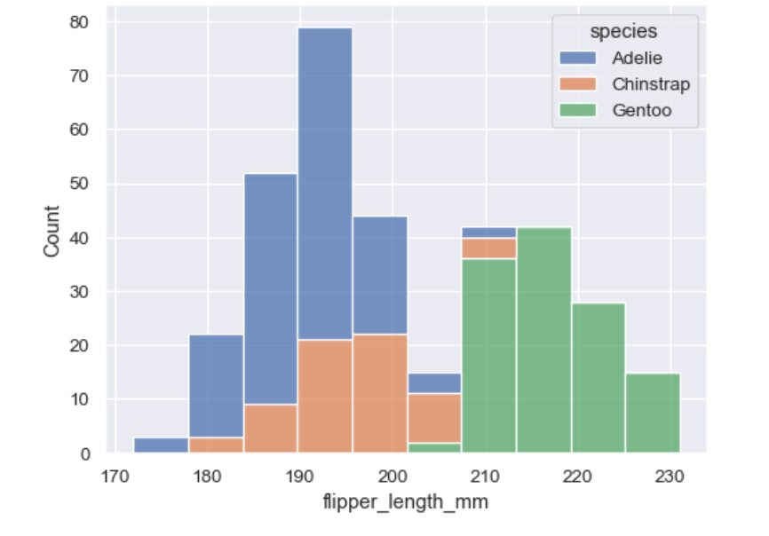

## Matplotlib Tutorial
matplotlib is probably the single most used Python package for 2D-graphics. It provides both a very quick way to visualize data from Python and publication-quality figures in many formats. We are going to explore matplotlib in interactive mode covering most common cases.

Matplotlib comes with a set of default settings that allow customizing all kinds of properties. You can control the defaults of almost every property in matplotlib: figure size and dpi, line width, color and style, axes, axis and grid properties, text and font properties and so on. While matplotlib defaults are rather good in most cases, you may want to modify some properties for specific cases.


pyplot
pyplot provides a convenient interface to the matplotlib object-oriented plotting library. It is modeled closely after Matlab(TM). Therefore, the majority of plotting commands in pyplot have Matlab(TM) analogs with similar arguments. Important commands are explained with interactive examples.

- Simple plot:
In this section, we want to draw the cosine and sine functions on the same plot. Starting from the default settings, we'll enrich the figure step by step to make it nicer.

The first step is to get the data for the sine and cosine functions:
```

import numpy as np

X = np.linspace(-np.pi, np.pi, 256, endpoint=True)
C, S = np.cos(X), np.sin(X)
```

X is now a NumPy array with 256 values ranging from -π to +π (included). C is the cosine (256 values) and S is the sine (256 values).

To run the example, you can download each of the examples and run it using:
```
$ python exercice_1.py
```

this is  the corresponding figure for the above code .


Matplotlib comes with a set of default settings that allow customizing all kinds of properties. You can control the defaults of almost every property in matplotlib: figure size and dpi, line width, color and style, axes, axis and grid properties, text and font properties and so on. While matplotlib defaults are rather good in most cases, you may want to modify some properties for specific cases.
---
## Seaborn Tutorial

- Overview of seaborn plotting functions :

The seaborn namespace is flat; all of the functionality is accessible at the top level. But the code itself is hierarchically structured, with modules of functions that achieve similar visualization goals through different means. Most of the docs are structured around these modules: you’ll encounter names like “relational”, “distributional”, and “categorical”.

For example, the distributions module defines functions that specialize in representing the distribution of datapoints. This includes familiar methods like the histogram:
```
penguins = sns.load_dataset("penguins")
sns.histplot(data=penguins, x="flipper_length_mm", hue="species", multiple="stack")
```



- Data structures accepted by seaborn :

As a data visualization library, seaborn requires that you provide it with data. This chapter explains the various ways to accomplish that task. Seaborn supports several different dataset formats, and most functions accept data represented with objects from the pandas or numpy libraries as well as built-in Python types like lists and dictionaries. Understanding the usage patterns associated with these different options will help you quickly create useful visualizations for nearly any dataset.

Long-form data:

A long-form data table has the following characteristics:

Each variable is a column

Each observation is a row


Wide-form data:

For simple datasets, it is often more intuitive to think about data the way it might be viewed in a spreadsheet, where the columns and rows contain levels of different variables. For example, we can convert the flights dataset into a wide-form organization by “pivoting” it so that each column has each month’s time series over years:


- Visualizing statistical relationships:

Statistical analysis is a process of understanding how variables in a dataset relate to each other and how those relationships depend on other variables. Visualization can be a core component of this process because, when data are visualized properly, the human visual system can see trends and patterns that indicate a relationship.

- Building structured multi-plot grids:

When exploring multi-dimensional data, a useful approach is to draw multiple instances of the same plot on different subsets of your dataset. This technique is sometimes called either “lattice” or “trellis” plotting, and it is related to the idea of “small multiples”. It allows a viewer to quickly extract a large amount of information about a complex dataset. Matplotlib offers good support for making figures with multiple axes; seaborn builds on top of this to directly link the structure of the plot to the structure of your dataset.

The figure-level functions are built on top of the objects discussed in this chapter of the tutorial. In most cases, you will want to work with those functions. They take care of some important bookkeeping that synchronizes the multiple plots in each grid. This chapter explains how the underlying objects work, which may be useful for advanced applications.


 


