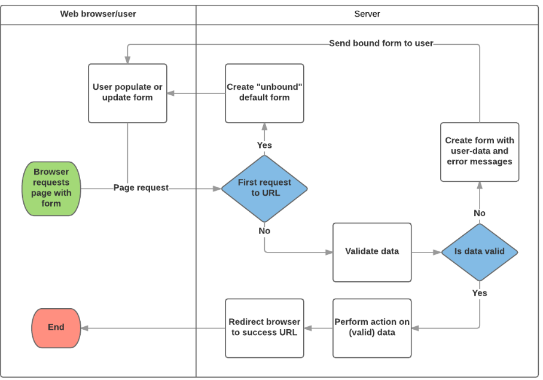

## Django Forms

An HTML Form is a group of one or more fields/widgets on a web page, which can be used to collect information from users for submission to a server. Forms are a flexible mechanism for collecting user input because there are suitable widgets for entering many different types of data, including text boxes, checkboxes, radio buttons, date pickers and so on. Forms are also a relatively secure way of sharing data with the server, as they allow us to send data in POST requests with cross-site request forgery protection.

Working with forms can be complicated! Developers need to write HTML for the form, validate and properly sanitize entered data on the server (and possibly also in the browser), repost the form with error messages to inform users of any invalid fields, handle the data when it has successfully been submitted, and finally respond to the user in some way to indicate success. Django Forms take a lot of the work out of all these steps, by providing a framework that lets you define forms and their fields programmatically, and then use these objects to both generate the form HTML code and handle much of the validation and user interaction.

The role of the server is first to render the initial form state — either containing blank fields or pre-populated with initial values. After the user presses the submit button, the server will receive the form data with values from the web browser and must validate the information. If the form contains invalid data, the server should display the form again, this time with user-entered data in "valid" fields and messages to describe the problem for the invalid fields. Once the server gets a request with all valid form data, it can perform an appropriate action (such as: saving the data, returning the result of a search, uploading a file, etc.) and then notify the user.

# Django form handling process

Django's form handling uses all of the same techniques that we learned about in previous tutorials (for displaying information about our models): the view gets a request, performs any actions required including reading data from the models, then generates and returns an HTML page (from a template, into which we pass a context containing the data to be displayed). What makes things more complicated is that the server also needs to be able to process data provided by the user, and redisplay the page if there are any errors.

A process flowchart of how Django handles form requests is shown below, starting with a request for a page containing a form (shown in green).

Based on the diagram above, the main things that Django's form handling does are:

1- Display the default form the first time it is requested by the user.
  
2- Receive data from a submit request and bind it to the form.
 

3- Clean and validate the data.
 
4- If any data is invalid, re-display the form, this time with any user populated values and error messages for the problem fields.

5- If all data is valid, perform required actions (such as save the data, send an email, return the result of a search, upload a file, and so on).

6- Once all actions are complete, redirect the user to another page.

Django provides a number of tools and approaches to help you with the tasks detailed above. The most fundamental is the Form class, which simplifies both generation of form HTML and data cleaning/validation. In the next section, we describe how forms work using the practical example of a page to allow librarians to renew books.

# Form
The Form class is the heart of Django's form handling system. It specifies the fields in the form, their layout, display widgets, labels, initial values, valid values, and (once validated) the error messages associated with invalid fields. The class also provides methods for rendering itself in templates using predefined formats (tables, lists, etc.) or for getting the value of any element (enabling fine-grained manual rendering).

# Declaring a Form
The declaration syntax for a Form is very similar to that for declaring a Model, and shares the same field types (and some similar parameters).  
 

 
 # Validation
Django provides numerous places where you can validate your data. The easiest way to validate a single field is to override the method clean_<fieldname>() for the field you want to check. So for example, we can validate that entered renewal_date values are between now and 4 weeks by implementing clean_renewal_date() as shown below.

# URL configuration

The URL configuration will redirect URLs with the format /catalog/book/<bookinstance_id>/renew/ to the function named renew_book_librarian() in views.py, and send the BookInstance id as the parameter named pk. The pattern only matches if pk is a correctly formatted uuid.

# The template

The "create" and "update" views use the same template by default, which will be named after your model: model_name_form.html (you can change the suffix to something other than _form using the template_name_suffix field in your view, for example template_name_suffix = '_other_suffix')

# Summary
Creating and handling forms can be a complicated process! Django makes it much easier by providing programmatic mechanisms to declare, render, and validate forms. Furthermore, Django provides generic form editing views that can do almost all the work to define pages that can create, edit, and delete records associated with a single model instance.
 
